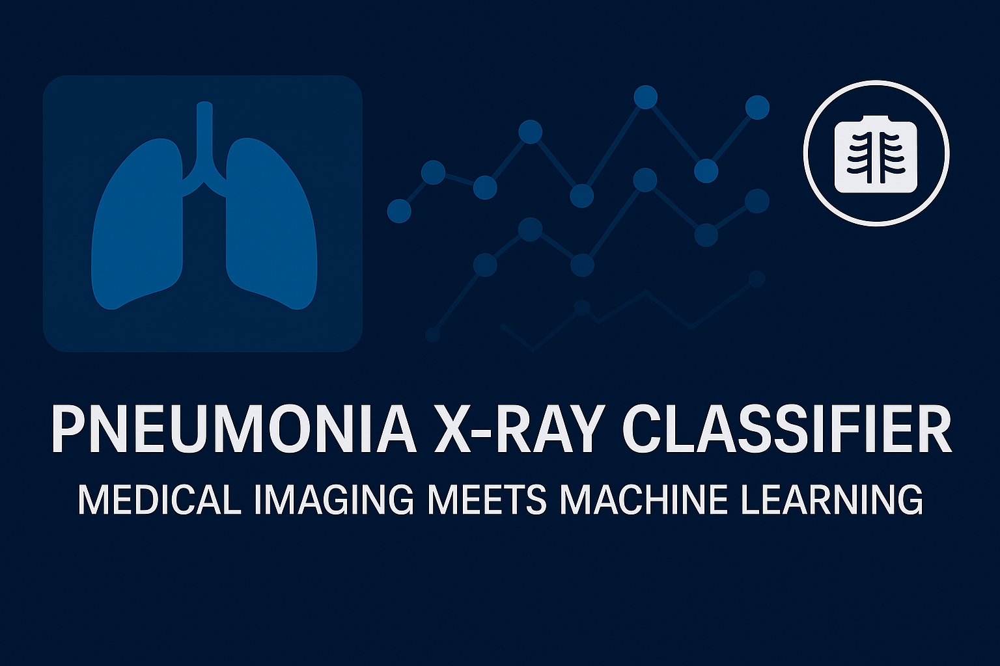

<p align="center">
  
</p>

<h1 align="center"> Pneumonia X-ray Classifier</h1>
<p align="center"><i>From pixel to prognosis: Deep learning-powered pneumonia detection with full visual explainability</i></p>

---

## 🧠 Overview

`pneumonia-xray-classifier` is a modular machine learning pipeline that leverages the PneumoniaMNIST dataset to detect pneumonia from chest X-ray images. This project integrates deep learning, model explainability, and deployment-ready architecture—tailored for real-world medical AI use cases.

Built from the ground up with reproducibility and extensibility in mind, it reflects best practices in ML engineering—from clean code organization to inference APIs and diagnostic visualization.

---

## ⚙️ Key Features

- 🩻 Loads and preprocesses medical images via the MedMNIST PyTorch API
- 🧠 Trains CNN models for binary classification (pneumonia vs. normal)
- 🔍 Visualizes predictions using Grad-CAM heatmaps and misclassification grids
- 🔁 Includes stratified cross-validation and evaluation pipelines
- 🧪 Reports confusion matrix and test-set accuracy
- 📤 Optimized for deployment (Flask/FastAPI-ready)

---

## 🚀 Getting Started

### 1. Clone the Repository

```bash
git clone https://github.com/Dartayous/pneumonia-xray-classifier.git
cd pneumonia-xray-classifier

